# Security Validation with Cisco SecureX

## About this idea

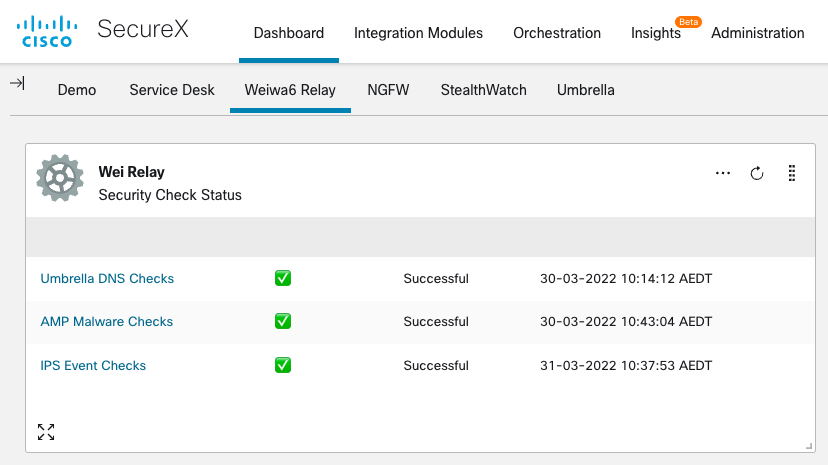  
It's one thing buying security controls for your endpoint, email etc., but what are you doing to confirm that they are alerting and reacting as you expect? In addition, is it a manual process that typically requires someone within the security team to proactively perform this testing to then highlight what success looks like?

With Cisco SecureX you can automate this process and deliver relevant information back to your team and management on how your investment in security is ensuring that your organisation is defended as intended and informed of any compromise attempt. It's an example of how through simple automation via SecureX you can change the way you perform the everyday tasks of securing your environment.

There are currently 3 type of events that can be generated by the scripts under "Modules" folder.

*   DNS events against Cisco Umbrella
*   Endpoint events against Cisco Secure Endpoint (f.k.a. AMP4E)
*   IPS events against Cisco NGFW

More to come for other products such as ESA, WSA, Stealthwatch, etc.

## How it works

There are multiple components required to automate the process. Here are the high level steps for each use case:

1.  SecureX Remote generate attack activity from SXO Remote, e.g. malicious DNS lookup against Umbrella VA
2.  Check expected result, e.g. DNS sinkhole address
3.  Check SxTR Sighting
4.  (Optional) Check SIEM logs, e.g. Splunk API query
5.  Update test result for Dashboard tile
6.  (Optional) Send notification, e.g. Webex message

## Prerequisite and Note

*   The scripts are based on SecureX - APJC instance. Please update the URL for other regions.
*   SXO Remote VM already deployed with ssh root access. Check [SecureX document](https://ciscosecurity.github.io/sxo-05-security-workflows/remote/setup) for details.
*   The script creates a SecureX casebook with title "SecurityValidation\_Results" to save the last test results in the notes section, which is used for dashboard tiles from relay module. DO NOT modify this casebook.
*   SIEM integration with Cisco products. The workflows use Splunk with Cisco products TA configured. Please validate the Splunk query syntax against your environment.   
    If this is not required, please skip and disable Splunk activities from SXO workflow.
*   Webex bot and credentials for sending message. Check [Webex and SecureX document](https://ciscosecurity.github.io/sxo-05-security-workflows/atomics/configuration/webex) for details.  
    If this is not required, please skip and disable Webex activities from SXO workflow.

## Installation

### SXO VM Preparation

1. Login to SXO Remote VM and install python  
    `sudo apt-get update`  
    `sudo apt-get install python3.8 python3-pip python3.8-venv`  
    `mkdir /home/ubuntu/SecValidation && python3 -m venv /home/ubuntu/SecValidation/venv`
2. Download repo to /home/ubuntu/SecValidation/ and test /home/ubuntu/runMyAPI.sh. Install missing dependencies from requirements.txt
3. Update root crontab to automatically start the python script  
    `crontab -e`  
    `#Add this to the end of the crontab:`  
    `@reboot su -c '/home/ubuntu/runMyAPI.sh' -s /usr/bin/bash ubuntu 2>&1`
4. Reboot SXO VM and confirm the scripts are running.

### SecureX Workflow - Umbrella DNS Validation

This workflow will query your local DNS server (Cisco Umbrella VA) with a malicious DNS. It expects a sink-hole address response and checks logs from CTR/Splunk.

1. Import Umbrella\_DNS\_Validation.json workflow.
2. Confirm the target is using the Remote connector as IP "172.17.0.1", which is the local IP on docker NIC. Do NOT change this IP.  
    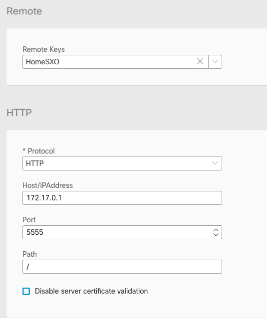
3. Update workflow variables:  
    "DNS\_Server" - this is your internal Umbrella VA to resolve DNS requests  
    "Remote\_SXO\_IP" -  this is your Remote SXO IP address, which will be used for CTR and Splunk log search  
    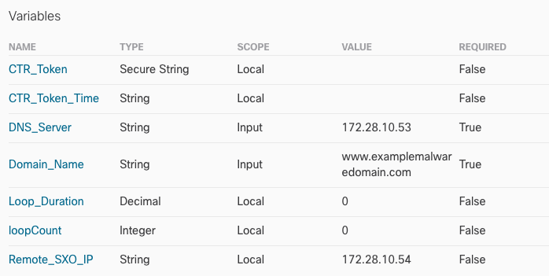
4. If Splunk is in use, update Splunk Target with Credentials. Update Splunk query syntax against your deployment if necessary.    
    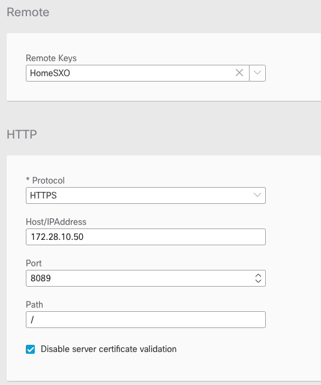  
    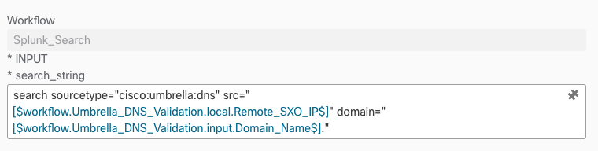
5. If Webex is in use, update Webex Target and Credentials.
6. Add scheduler trigger for the workflows if required.
7. Here is the screenshot of a webex message showing the workflow result.    
    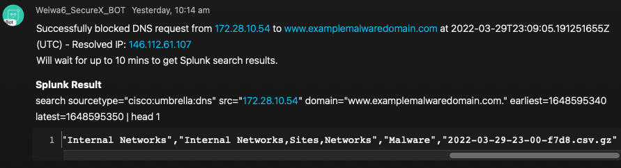

### SecureX Workflow - Secure\_Endpoint\_Malware\_Validation

This workflow will drop an EICAR test file to your Windows PC, (with Cisco Secure Endpoint already installed), via remote PowerShell. It will check logs from Secure Endpoint API and Splunk to confirm successful detection.  
Make sure PowerShell Remote service and firewalls permit traffic from your SXO Remote connector to the PC

1. Import Secure\_Endpoint\_Malware\_Validation.json workflow
2. Update workflow variables:  
    "Query\_IP" - this is your PC IP address  
    "username" - username that  powershell will use to execute  
    "password" - password that powershell will use to execute    
    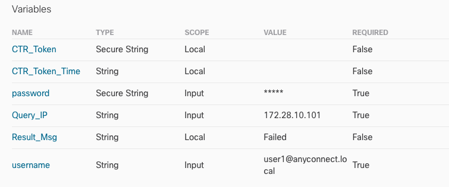
3. If Splunk is in use, update Splunk Target with Credentials. Update Splunk query syntax against your deployment if necessary.  
    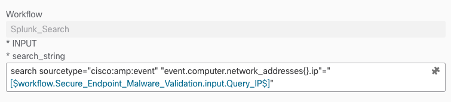  
4. Add scheduler trigger for the workflows if required.
5. Here is the screenshot of a webex message showing the workflow result.    
    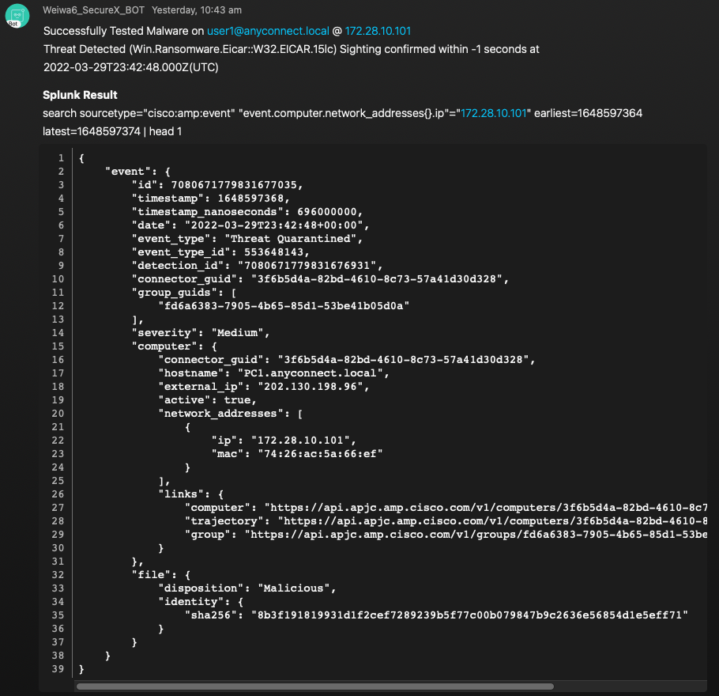

### SecureX Workflow - IPS\_Validation

This workflow will launch a dummy Log4j attempt to one of your internal web server. Make sure NGFW are deployed to detect such traffic. FMC should be integrated with SecureX to send those events to SSE, which should be promoted to incidents. The workflow will validate the private intelligence sources and Splunk to confirm successful detection.

1. Import IPS\_Validation.json workflow
2. Update the internal web server target IP in "Lab\_Apache\_SXO"    
    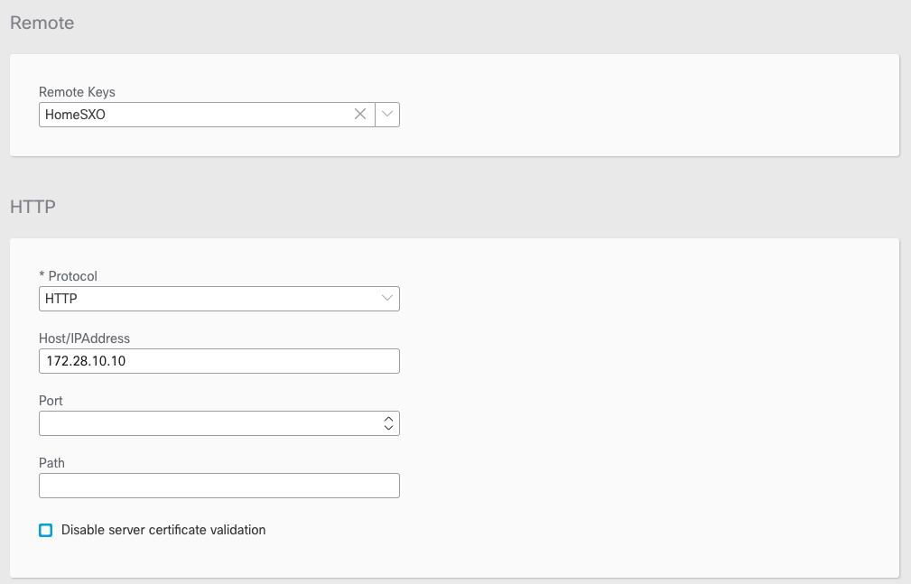
3. Update workflow variable:  
    "Remote\_SXO\_IP" - this is your Remote SXO IP address, which will be used for CTR and Splunk log search    
    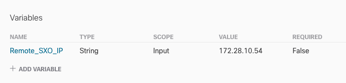
4. If Splunk is in use, update Splunk Target with Credentials. Update Splunk query syntax against your deployment if necessary.    
    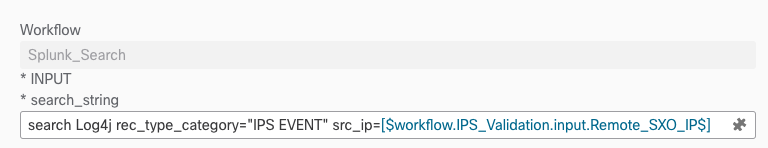
5. Add scheduler trigger for the workflows if required.
6. Here is the screenshot of a webex message showing the workflow result.    
    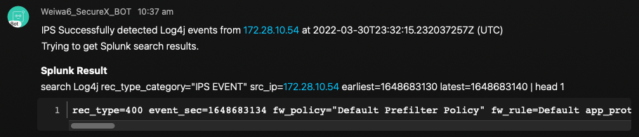

### Dashboard Tiles

1. Download and deploy "Dashboard_Relay" to your server.
2. Rename "config.py.example" to "config.py" with your JWT keys
3. Update "SECUREX_CLIENT" with your SecureX API client credential, with permission to casebook in order to retrieve test results.
4. Update SecureX URL in utls.py and dashboard.py, if not in SecureX APJC region.
5. Add a new "Generic Serverless Relay" module and enable the tile to the dashboard.    
    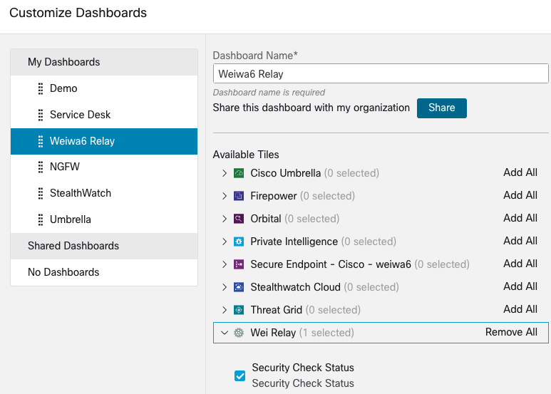
